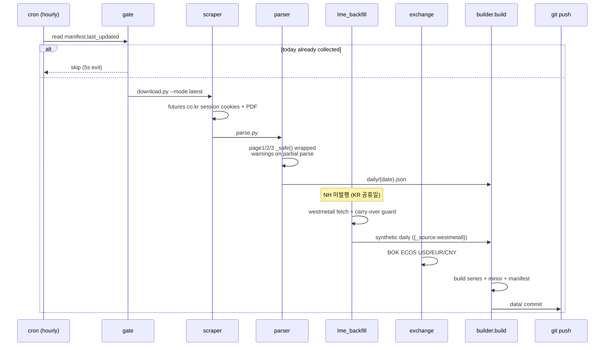
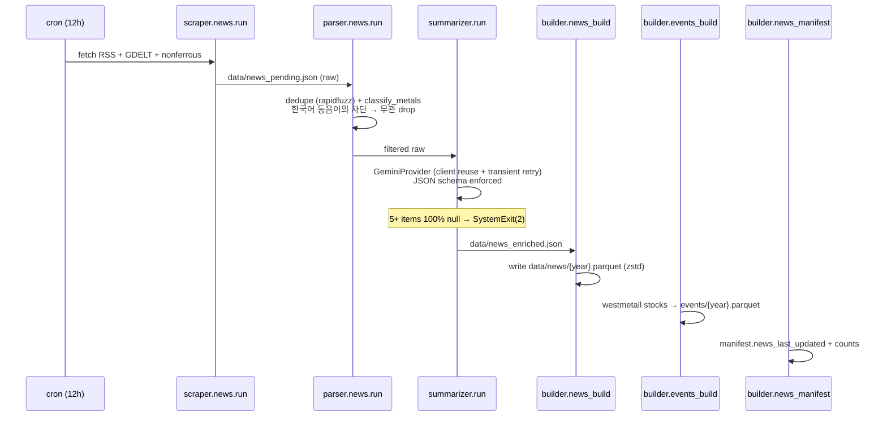
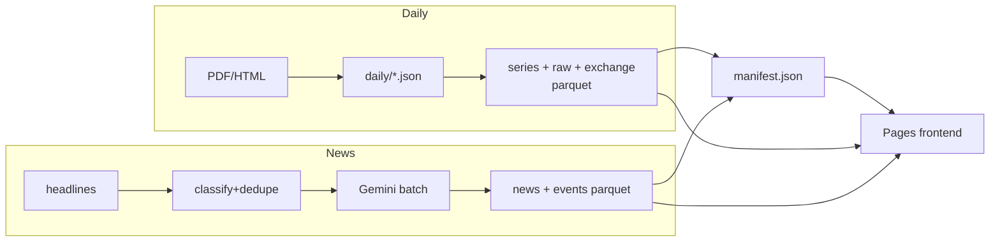

# Architecture

서버리스 비철금속 데스크. PDF/HTML 스크래핑 → Parquet → GitHub Pages.
Python 3.14 (uv) + Vanilla JS ESM (hyparquet CDN) + GitHub Actions cron.

## 시스템 개요

```mermaid
flowchart LR
    subgraph Sources["External Sources"]
        NH[NH선물 PDF<br/>futures.co.kr]
        WM[westmetall.com<br/>fallback]
        BOK[BOK ECOS<br/>USD/EUR/CNY]
        RSS[RSS feeds<br/>mining.com / 철강금속신문]
        GDELT[GDELT 2.0]
        NF[nonferrous.or.kr]
        GEM[Gemini 2.5 Flash]
    end

    subgraph Pipelines["GitHub Actions cron"]
        COL[collect.yml<br/>KST 9~19h hourly]
        NEW[news.yml<br/>KST 9/21h]
        PG[pages.yml<br/>on push]
    end

    subgraph Storage["data/ (committed)"]
        RAW[raw/{year}.parquet<br/>daily JSON archive]
        SER[series/{metal}/{year}.parquet<br/>+ latest.parquet]
        SB[minor/antimony.parquet]
        EX[exchange.parquet]
        NWS[news/{year}.parquet]
        EVT[events/{year}.parquet]
        MAN[manifest.json<br/>SoT]
    end

    subgraph FE["GitHub Pages"]
        SITE[site/<br/>vanilla JS + hyparquet ESM]
    end

    NH --> COL
    WM --> COL
    BOK --> COL
    COL --> RAW & SER & SB & EX & MAN

    RSS --> NEW
    GDELT --> NEW
    NF --> NEW
    GEM --> NEW
    WM --> NEW
    NEW --> NWS & EVT & MAN

    Storage --> PG
    PG --> SITE
    SITE -->|fetch parquet| Storage

    User((User)) --> SITE
```

## 가격 파이프라인 (collect.yml)



## 뉴스 파이프라인 (news.yml)



## 프론트엔드

```mermaid
flowchart TB
    INDEX[index.html]
    CFG[config.js<br/>DATA_BASE export]
    APP[app.js<br/>main]
    NEWS[news.js<br/>drawer + markers + tweaks]
    HYP[hyparquet@1.25.6<br/>ESM CDN pinned]

    INDEX --> APP
    APP -->|import| NEWS
    APP -->|import| CFG
    NEWS -->|import| CFG
    APP -->|import| HYP
    NEWS -->|import| HYP

    APP -->|fetch| MAN[manifest.json]
    APP -->|fetch| LATEST[series/*/latest.parquet ×6]
    APP -->|lazy| YEAR[series/{metal}/{year}.parquet]
    APP -->|lazy| MIN[minor/antimony.parquet]
    NEWS -->|fetch| NWS[news/{year}.parquet]
    NEWS -->|fetch| EVT[events/{year}.parquet]

    USER((User)) --> INDEX
    USER -->|click expand| APP
    USER -->|toggle drawer| NEWS
```

**Pages 배포 트릭:** `site/` 로컬은 `../data` 상대경로. Pages는 `_site/` 루트 (data/ flat). `pages.yml`이 `config.js` sed 1줄로 `./data` 패치.

## 데이터 흐름 (요약)



## 주요 모듈

| 모듈 | 역할 | 핵심 함수 |
|---|---|---|
| `scraper/download.py` | NH PDF 다운로드 + dedupe | `existing_dates()`, `download_pdfs()` |
| `scraper/lme/prices.py` | westmetall settlement HTML | `fetch_settlement()` |
| `scraper/lme/stocks.py` | LME stocks 일일 스냅샷 | `fetch_stocks()` |
| `scraper/news/{rss,gdelt,nonferrous}.py` | source-specific scrapers | `NewsSource.fetch()` |
| `parser/page{1,2,3}.py` | PDF 테이블 → dict | `_safe()` wrapped |
| `parser/news/classify.py` | 1차 metal 매칭 + 한국어 negative pattern | `classify_metals()` |
| `parser/news/dedupe.py` | rapidfuzz title similarity | `dedupe()` |
| `summarizer/providers/gemini.py` | LLM batch (client reuse + 429/5xx retry) | `GeminiProvider.summarize_batch()` |
| `summarizer/client.py` | provider failover Protocol | `SummarizerClient.summarize()` |
| `builder/build.py` | daily JSON → series parquet + manifest | `METALS`, `resolve_rate()` |
| `builder/lme_backfill.py` | westmetall fallback + carry-over guard | `backfill()`, `_is_carry_over()` |
| `builder/events_build.py` | LME stocks → events parquet | |
| `site/app.js` | dashboard, chart overlay (req-id token) | `openChart()`, `loadFullSeries()` |
| `site/news.js` | drawer + chart markers + tweaks (localStorage) | `chartMarkersFor()`, `unseenCount()` |
| `site/config.js` | DATA_BASE single source | |

## 데이터 스키마 (요약)

### `data/series/{metal}/{year}.parquet`
flat columns. 핵심: `date, lme_cash_close, lme_3m_close, lme_3m_open, lme_3m_high, lme_3m_low, lme_3m_bid, lme_3m_ask, lme_3m_oi, settlement_cash, settlement_3m, inventory_total, inventory_in, inventory_out, inventory_cw, shfe_close, shfe_premium, krw_close, krw_source, _source` (last for westmetall fallback marker).

### `data/news/{year}.parquet`
`date, source, url, url_hash, title, summary_ko, metals[], sentiment{-1,0,1}, event_type{supply,demand,policy,macro,other}, confidence, lang`.

### `data/events/{year}.parquet`
`date (date32), type{lme_stock,lme_announce,macro}, metal, magnitude, title, url, source`.

### `data/manifest.json`
single SoT: `metals{}, minor_metals{}, years[], latest_window, last_updated, news_last_updated, schema`.

## 보안 핀

- `actions/checkout@93cb6efe...` (v5) — collect/news/pages
- `astral-sh/setup-uv@08807647...` (v8.1.0) — collect/news
- `hyparquet@1.25.6`, `hyparquet-compressors@1.1.1` — exact CDN URL pin in app.js + news.js

## 신뢰성 가드

- `parser/parse.py` `_safe()` 래퍼 — 페이지 부분 실패 시 `_warnings`에 기록, 다른 섹션 보존
- `summarizer/run.py` freshness fail — 5+ items 전부 null → SystemExit(2) (silent LLM outage 차단)
- `summarizer/providers/gemini.py` 429 + 5xx만 재시도 (1회) — permanent error 즉시 propagate
- `builder/lme_backfill.py` `_is_carry_over` — westmetall이 휴장일 carry-over 데이터 등록 차단
- `site/app.js` chart overlay request-id token — async race로 잘못된 차트 표시 방지
- `data/.sb_last_check` — Sb 일 1회 가드 (sb scraper 비용 보호)
